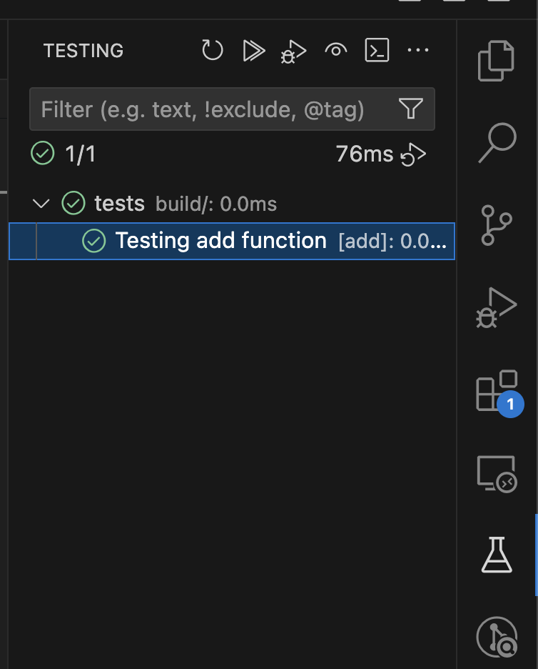

# Използване на Catch2 Framework със Cmake за Тестване в C++

# 1. Създаване на проект

1. Създадете папка за вашият проект и създайте следващите файлове в тази папка

1. Създайте папка `lib`

Тул може да поставяте библиотеки, които искате да ползвате.

2. Създадете `main.cpp`:
```cpp
#include "functions.h"

#include <iostream>

using namespace std;

int main() {
    cout << "Hello, World!" << endl;
    cout << "2 + 2 = " << add(2, 2) << endl;
    return 0;
}
```

3. Създадете `functions.h`:
```cpp
#pragma once

int add(int a, int b);
```

4. Създадете `functions.cpp`:
```cpp
#include "functions.h"

int add(int a, int b) {
    return a + b;
}
```

1. Създайте папка `tests`

1. В папката тест създайте `test_functions.cpp`:
```cpp
#include <catch2/catch_all.hpp>
#include "../functions.h" // Include the header file

TEST_CASE("Testing add function", "[add]") {
    REQUIRE(add(2, 3) == 5);
    REQUIRE(add(-1, 1) == 0);
}
```

2. Създадете файл `CMakeLists.txt`:
```
cmake_minimum_required(VERSION 3.14)

# Project name and version
project(MyProjectName VERSION 1.0 LANGUAGES CXX)

# Set the C++ standard
set(CMAKE_CXX_STANDARD 17)
set(CMAKE_CXX_STANDARD_REQUIRED ON)
set(CMAKE_CXX_EXTENSIONS OFF)

# Make Catch2 available
if(BUILD_TESTING)

  message(STATUS "Make Catch2 available...")

  if(EXISTS ${CMAKE_SOURCE_DIR}/lib/Catch2)

    # If Catch2's repo has been cloned to the /lib directory, use that    
    add_subdirectory(${CMAKE_SOURCE_DIR}/lib/Catch2)
  
  else()

    # Try to either find a local installation of Catch2,
    # or download it from its repository.
    #
    # You can find more information on how FetchContent works and
    # what is the order of locations being searched in these sources:
    #
    # Using Dependencies Guide
    #   https://cmake.org/cmake/help/latest/guide/using-dependencies/index.html#guide:Using%20Dependencies%20Guide
    # FetchContent examples:
    #   https://cmake.org/cmake/help/latest/module/FetchContent.html#fetchcontent-find-package-integration-examples
    # If necessary, set up FETCHCONTENT_TRY_FIND_PACKAGE_MODE. Check:
    #   https://cmake.org/cmake/help/latest/module/FetchContent.html#variable:FETCHCONTENT_TRY_FIND_PACKAGE_MODE
    # For Catch2's own documentation on CMake integration check:
    #   https://github.com/catchorg/Catch2/blob/devel/docs/cmake-integration.md
    
    include(FetchContent)

    # FIND_PACKAGE_ARGS makes it so that CMake first tries to find
    # CMake with find_package() and if it is NOT found, it will
    # be retrieved from its repository.
    FetchContent_Declare(
        Catch2
        GIT_REPOSITORY https://github.com/catchorg/Catch2.git
        GIT_TAG        v3.4.0
        FIND_PACKAGE_ARGS
    )

    FetchContent_MakeAvailable(Catch2)

    # The line below was necessary when Catch2 was obtained with FetchContent,
    # as described here:
    #   https://github.com/catchorg/Catch2/blob/devel/docs/cmake-integration.md)
    # This does not seem to be the case anymore.
    # list(APPEND CMAKE_MODULE_PATH ${catch2_SOURCE_DIR}/extras)

  endif()

  # Include the Catch module, which provides catch_discover_tests
  include(Catch)

  # Status messages
  message(STATUS "Catch2_DIR: ${Catch2_DIR}")
  message(STATUS "catch2_SOURCE_DIR: ${catch2_SOURCE_DIR}")
  message(STATUS "Catch2_SOURCE_DIR: ${Catch2_SOURCE_DIR}")
  message(STATUS "CMAKE_MODULE_PATH: ${CMAKE_MODULE_PATH}")

endif()


SET(SOURCES
    functions.cpp
)

SET(TEST_SOURCES
    tests/test_functions.cpp
)

# Add the main executable
add_executable(main main.cpp ${SOURCES})

# Add the test executable
add_executable(tests ${TEST_SOURCES} ${SOURCES})

# Link Catch2 to the test executable
target_link_libraries(tests PRIVATE Catch2::Catch2WithMain)

# Enable testing and automatically register tests with CTest
include(CTest)
catch_discover_tests(tests)
```

Финалната структура на проекта изглежда по този начин:
- project
  - lib
  - tests
    - test_functions.cpp
  - main.cpp
  - functions.h
  - functions.cpp
  - CMakeLists.txt

Може да я разгледате в [project](./project)

# 2. Добавяне на catch2 библиотеката към проекта (по-желание)

Клонирайте catch2 библиотеката от GitHub в папката lib:
- `git clone https://github.com/catchorg/Catch2.git`

# 3. Изграждане на проекта

В папката на проекта изпълнете в терминал командата:
- За windows: `cmake -G "MinGW Makefiles" -S . -B build`
  - Тази команда е подобна на предишната, но допълнително указва на CMake да използва генератора "MinGW Makefiles". Това е полезно, ако използвате MinGW като компилатор на Windows. Генераторът "MinGW Makefiles" създава Makefile, който може да бъде използван от mingw32-make за изграждане на проекта.
- За macos: `cmake -S . -B build`
  - Тази команда казва на CMake да използва текущата директория (.) като изходен код и да създаде всички файлове за изграждане в поддиректорията build. Това е стандартен начин за отделяне на изходния код от файловете за изграждане, което прави проекта по-организиран.

Компилрайте прокета със следната командата в терминала:
- `cmake --build build`
  - Тази команда ще изгради проекта, като използва файловете за изграждане, създадени в папката build.

Изпълнимите файлове `main` и `tests` се намират в build директорията.

# 4. Стартиране на main

- За macos: `./build/main`

# 5. Стартиране на тестовете чрез изпълнителен файл

## 5.1. Стартиране чрез изпълнителния файл

- За macos: `./build/tests`

## 5.2. Стартиране чрез CTest

Изпълнете командата в терминала:
- `ctest --test-dir build`

## 5.3. Стартиране чрез Microsoft Visual Studio Code UI




